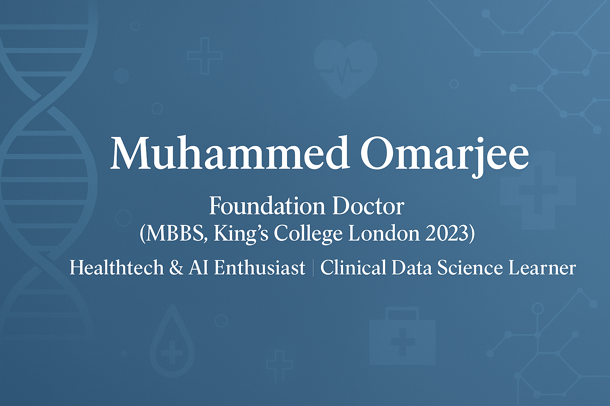

<!-- PROFILE HEADER -->

  

<h1 align="center">👋 Hi, I'm <b>Muhammed Omarjee</b></h1>

  🚑 <b>Foundation Doctor (MBBS, King’s College London 2023)</b> 
  💡 <b>Healthtech & AI Enthusiast | Clinical Data Science Learner</b>

  
  

---

## 🩺 Featured Projects

| Project | Description |
|----------|--------------|
| 🫁 [**Chest X-ray Pneumonia Detection**](https://github.com/M-Omarjee/chest-xray-pneumonia) | CNN-based computer vision model that detects pneumonia and provides visual explainability via Grad-CAM. |
| 💬 [**Primary Care Triage AI**](https://github.com/M-Omarjee/triage-primary-care) | NLP model classifying primary care symptom text into **Emergency · Urgent · Routine · Self-care**. |
| ⚙️ **Sepsis NICE Guideline AI** *(coming soon)* | Clinical NLP project that identifies red-flag sepsis features using NICE pathway logic. |

---

## 🧾 Certifications

| Certification | Issuer | Logo |
|----------------|---------|------|
| **ICH-GCP (Good Clinical Practice)** | NIHR / Transcelerate |  |
| **ABPI Code of Practice Certification** | ABPI |  |
| **Google AI Essentials** | Coursera × Google |   |
| **AI in Healthcare (University of Colorado)** | Coursera |   |

---

## 🧰 Technical Stack

**Languages:** Python, SQL, Markdown  
**Libraries:** scikit-learn, pandas, matplotlib, TensorFlow  
**Domains:** Primary Care, Clinical Data, NLP, AI in Healthcare  

  
  
  
  
  

---

## 🧠 Interests & Goals

- Applying **AI to diagnostic triage** in **primary care and radiology**.  
- Building **explainable NLP models** clinicians can trust.  
- Exploring **digital health product design** and clinical data governance.  
- Long-term: lead innovation that merges **clinical reasoning** with **data-driven insights**.

---

## 📈 GitHub Snapshot

  
  

---

## ⚠️ Disclaimer

This profile and its projects are for **educational and exploratory purposes** only and are **not clinical decision-making tools**.

---

<i>“Exploring the intersection of medicine, data, and innovation to build safer, smarter healthcare systems.”</i>

