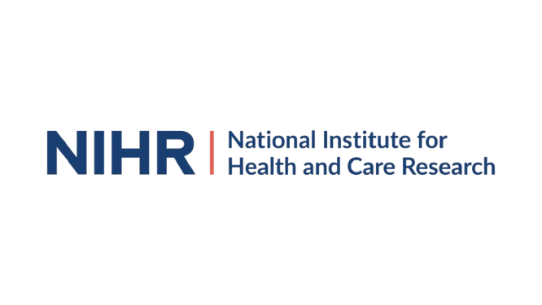
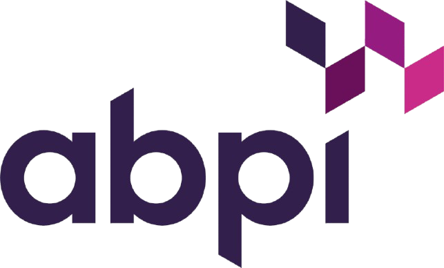

<!-- PROFILE HEADER -->

  

<h1 align="center">👋 Hi, I'm <b>Muhammed Omarjee</b></h1>

  🚑 <b>Foundation Doctor (MBBS, King’s College London 2023)</b> 
  💡 <b>Healthtech & AI Enthusiast | Clinical Data Science Learner</b>

  &nbsp;&nbsp;
  &nbsp;&nbsp;
  

---

## 🩺 Featured Projects

| Project | Description |
|----------|--------------|
| 🫁 [**CXR Pneumonia Detection**](https://github.com/M-Omarjee/chest-xray-pneumonia-ai) | CNN-based computer vision model that detects pneumonia and provides visual explainability via Grad-CAM. |
| 💬 [**Primary Care Triage AI**](https://github.com/M-Omarjee/triage-primary-care) | NLP model classifying primary care symptom text into **Emergency · Urgent · Routine · Self-care**. |
| ⚙️ [**Sepsis Early Detection AI**](https://github.com/M-Omarjee/sepsis-ai) | Using NEWS2 values to create a ML model built in Python using Logistic Regression |
| 📝 [**Ward Round Template with AI**](https://github.com/M-Omarjee/ward-round-template) | A responsive ward-round documentation template with a single-page frontend and a Flask API that generates concise, clinically-prioritised summaries from free-text notes. |
| 💊 [**De Novo Drug Design**](https://www.github.com/M-Omarjee/de-novo-drug-design) | Generative RNN trained to invent over 600 novel, chemically valid drug candidates. |
| 📊 [**ProjectPulse Dashboard**](https://www.github.com/M-Omarjee/projectpulse-dashboard) | FastAPI + Streamlit analytics platform that visualises real-time project KPIs, risks, and financial performance to power data-driven decision-making. |
| 🔍 [**AuditAI**](https://www.github.com/M-Omarjee/audit-ai) | a Streamlit-powered app that automates clinical audit analysis and generates polished, NHS-style compliance reports in seconds. |

---

## 🧾 Certifications

| Certification | Issuer | Focus / Key Area | Logo |
| :--- | :--- | :--- | :--- |
| **ICH-GCP (Good Clinical Practice)** | NIHR / Transcelerate | Principles of clinical trial conduct and ethics. | 

 |
| **ABPI Code of Practice Certification** | ABPI | Ethical promotion of prescription medicines in the UK. | 

 |
| **Google AI Essentials** | Coursera × Google | Core concepts in Generative AI and ML fundamentals. |   |
| **AI in Healthcare (University of Colorado)** | Coursera | Applying deep learning models to medical datasets. |   |

---
## 🧰 Technical Stack

**Languages:** Python, SQL, Markdown  
**Libraries:** scikit-learn, pandas, matplotlib, TensorFlow  
**Domains:** Primary Care, Clinical Data, NLP, AI in Healthcare  

  
  
  
  
  

---

## 🧠 Interests & Goals

- Applying **AI to improve patient outcomes and system efficiency** across **the UK healthcare system**.  
- Building **explainable NLP models** clinicians can trust.  
- Exploring **digital health product design** and clinical data governance.  
- Long-term: lead innovation that merges **clinical reasoning** with **data-driven insights**.

---
## 🧩 GitHub Snapshot

---

## ⚠️ Disclaimer

This profile and its projects are for **educational and exploratory purposes** only and are **not clinical decision-making tools**.

---

<i>“Exploring the intersection of medicine, data, and innovation to build safer, smarter healthcare systems.”</i>

